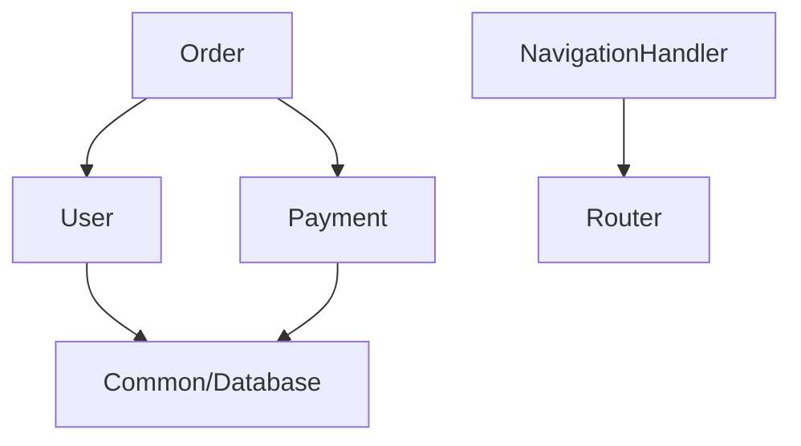

# /module-index

为项目模块生成结构化索引，让 AI 快速理解模块而无需读取全部代码。

## 用法

```bash
/module-index <模块路径>
/module-index app/Module/User
/module-index app/Module/AiCreationCenter
/module-index <路径> --update  # 更新已有索引
```

## 路径说明

**索引存储在项目目录**：`./.claude/modules/`

```bash
# 在项目目录执行
/module-index app/Module/User

# 保存到
→ ./.claude/modules/User-index.md
```

## 输出目录结构

```
./.claude/modules/
├── User-index.md
├── Order-index.md
├── AiCreationCenter-index.md
└── INDEX.md  # 总索引
```

## 执行流程

1. 分析模块目录结构
2. 识别关键类和方法
3. 分析依赖关系
4. 生成索引文件

## 单个模块索引格式

每个模块索引文件（如 `User-index.md`）应该简洁精准：

```markdown
# User 模块

> 路径: `app/Module/User`  
> 更新: 2026-02-11

## 职责
用户注册、登录、个人信息管理等功能。

## 目录结构
```
app/Module/User/
├── Controller/UserController.php
├── Service/
│   ├── UserService.php
│   └── AuthService.php
├── Model/User.php
└── Repository/UserRepository.php
```

## 关键入口

**API 端点**
- `POST /api/user/login` - 用户登录
- `POST /api/user/register` - 用户注册  
- `GET /api/user/profile` - 获取个人信息

**核心类**
- `UserController` - 用户请求处理
- `UserService` - 用户业务逻辑
- `AuthService` - 认证服务

## 依赖
- `Common/Database` - 数据库访问
- `Redis` - 用户会话缓存
```

**原则**：
- 📌 **职责**：一句话说清楚模块做什么
- 📁 **目录结构**：简洁的树状图，只列主要文件
- 🔑 **关键入口**：API 端点和核心类，方便快速定位
- 🔗 **依赖**：列出外部依赖，不需要详细说明每个类的每个方法

## INDEX.md 格式说明

**INDEX.md 是纯索引文件，只包含数据，不包含使用说明！**

生成/更新 `./.claude/modules/INDEX.md` 时，格式如下：

```markdown
# 模块索引

> 最后更新: <日期>  
> 模块总数: <数量>

## 📋 索引列表

| 模块 | 路径 | 索引文件 | 更新时间 | 职责 | 标签 |
|------|------|----------|----------|------|------|
| User | app/Module/User | [User-index.md](./User-index.md) | 2026-02-11 | 用户注册、登录、个人信息管理 | `auth`, `backend` |
| Order | app/Module/Order | [Order-index.md](./Order-index.md) | 2026-02-10 | 订单管理相关功能 | `business`, `backend` |
| NavigationHandler | src/renderer/src/handler | [NavigationHandler-index.md](./NavigationHandler-index.md) | 2026-02-09 | 应用内快捷键导航 | `frontend`, `react` |

## 🏗️ 模块依赖关系



**依赖说明**：
- `Order` 依赖 `User`（订单需要用户信息）
- `Order` 依赖 `Payment`（订单需要支付功能）
- `User`, `Payment` 都依赖 `Common/Database`

## 🔍 按技术栈索引

### Frontend
- **React** - NavigationHandler, Router, UI/Components
- **Electron** - NavigationHandler, IPC/Handler

### Backend  
- **PHP/Laravel** - User, Order, Payment
- **Node.js** - API/Gateway

### Database
- **MySQL** - User, Order, Payment
- **Redis** - User (会话), Order (缓存)

## 🏷️ 按标签索引

### 业务标签
- `#auth` - User
- `#business` - Order, Payment, Product
- `#content` - Article, Media

### 技术标签
- `#frontend` - NavigationHandler, Router, UI/Components
- `#backend` - User, Order, Payment
- `#api` - API/Gateway
- `#database` - Common/Database

### 层级标签
- `#controller` - User, Order, Payment
- `#service` - User, Order, Payment
- `#repository` - User, Order, Payment

## 📦 按业务域分类

### 用户域
- User - 用户管理
- Auth - 认证授权

### 交易域
- Order - 订单管理
- Payment - 支付处理
- Product - 商品管理

### 内容域
- Article - 文章管理
- Media - 媒体资源管理

### 基础设施
- Common/Database - 数据库访问层
- Common/Cache - 缓存服务
- API/Gateway - API 网关

## 🔗 常见场景快速索引

**需要修改用户相关功能？**
- 核心: [User-index.md](./User-index.md)
- 相关: Auth, Order

**需要修改订单流程？**
- 核心: [Order-index.md](./Order-index.md)
- 相关: User, Payment, Product

**需要添加前端导航？**
- 核心: [NavigationHandler-index.md](./NavigationHandler-index.md)
- 相关: Router, UI/Components

---
*使用 `/module-index <路径>` 生成或更新模块索引*
```

**重要原则**：
- ✅ **多维度索引**：支持按依赖关系、技术栈、标签、业务域、场景查找
- ✅ **关系可视化**：用 Mermaid 图展示模块依赖关系
- ✅ **场景导向**：提供常见场景的快速索引
- ❌ 不要在 INDEX.md 中重复说明"如何使用"、"索引格式"等内容
- 📌 这些说明已经在本 command 文档中，不需要重复
